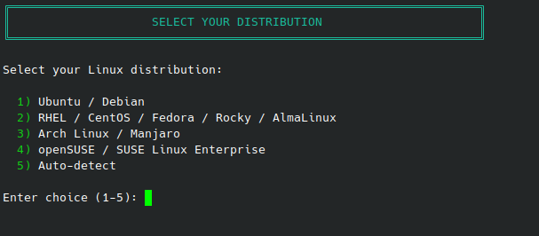
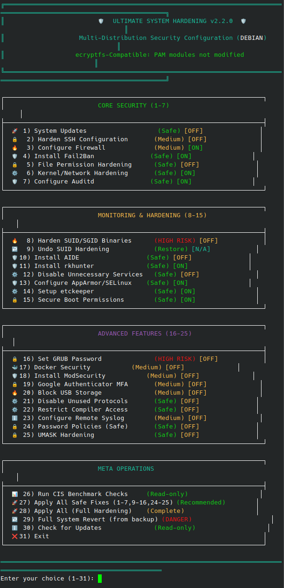
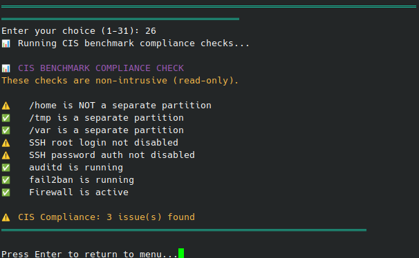

# 🔒 Ultimate System Hardening Script
**CIS Benchmark Aligned Linux Security Automation for Ubuntu, RHEL, Arch, and SUSE**

[](https://github.com/Kal1010101/ultimate-sys-hardening)
[](https://github.com/Kal1010101/ultimate-sys-hardening)
[](https://github.com/Kal1010101/ultimate-sys-hardening)
[](https://github.com/Kal1010101/ultimate-sys-hardening/actions)
[](https://github.com/Kal1010101/ultimate-sys-hardening)

> **Keywords:** Linux hardening · security automation · CIS benchmark · PAM-safe · system hardening · bash script · 30 security features · multi-distribution · Ubuntu · RHEL · Arch · SUSE · sysctl · auditd · fail2ban

---

## 📊 Project Status

| Metric | Last 14 Days |
|--------|--------------|
| **Total Clones**      | 79 |
| **Unique Cloners**    | 43 |
| **Total Views**       | 254|
| **Unique Visitors**   | 11 |

📈 **Views are up 36%** and the project is gaining traction!

---

## 🔍 Also Check Out
[System Debug & Security Audit Script](https://github.com/Kal1010101/sysdebug) – Diagnose issues and detect anomalies on your system

---

## ⭐ Support This Project
If this script helped you, please consider **starring** this repository! ⭐

It helps others find it and motivates continued development.

**113 sysadmins have already engaged with this script in the last 14 days.** Join them!

---

## 🚀 What's New in v2.2.0

| Feature | Description |
|---------|-------------|
| **Option 25: UMASK Hardening** | Sets restrictive default umask (027) via `/etc/login.defs`, `/etc/profile.d/`, and `/etc/bash.bashrc` |
| **Option 30: Check for Updates** | Queries GitHub for the latest commit – check if you're running the latest version! |
| **Live Status Badges** | [ON]/[OFF]/[N/A] indicators show what's already applied on your system |
| **Improved Revert** | Auto-finds latest backup if the current one doesn't exist |
| **30 Security Features** | CIS Benchmark aligned – now with UMASK hardening |

### 🔧 v2.1.0 Highlights (Still Current)
- ✅ **PAM-Safe** – Never touches `/etc/pam.d/*` files (no more ecryptfs/KDE-Plasma login breakage!)
- ✅ **Multi-distribution** support (Debian, RHEL, Arch, SUSE)
- ✅ **29 security features** aligned with CIS benchmarks
- ✅ **Dry-run mode** and **full revert** capabilities

---

## 📋 What This Script Hardens (30 Security Features)

| # | Security Area | Actions Taken | Risk Level |
|---|---------------|----------------|------------|
| 1 | **System Updates**| Updates all packages to latest versions                                 | ✅ Safe |
| 2 | **SSH Hardening** | Disables root login, enforces key-only auth, MaxAuthTries 3             | ⚠️ Medium |
| 3 | **Firewall**      | Configures nftables, denies all except SSH/HTTP/HTTPS                   | ⚠️ Medium |
| 4 | **Fail2Ban**      | Auto-blocks IPs after 3 failed SSH attempts                             | ✅ Safe |
| 5 | **File Permissions** | Secures /etc/shadow, /etc/gshadow, /etc/sudoers                      | ✅ Safe |
| 6 | **Kernel Hardening** | Applies restrictive sysctl parameters (rp_filter, syncookies, ASLR)  | ✅ Safe |
| 7 | **Auditd**           | Configures system auditing, monitors sensitive file changes          | ✅ Safe |
| 8 | **SUID Hardening**   | Removes SUID from non-essential binaries (at, crontab, chage, etc.)  | 🔴 High Risk |
| 9 | **Undo SUID**        | Restores SUID permissions from backup                                | ✅ Restore |
| 10 | **AIDE**            | Installs file integrity monitoring (tripwire alternative)            | ✅ Safe |
| 11 | **rkhunter**        | Installs rootkit hunter scanner                                      | ✅ Safe |
| 12 | **Disable Services**| Disables avahi-daemon, cups, nfs-server, rpcbind, slapd, named, postfix | ✅ Safe |
| 13 | **AppArmor/SELinux**| Configures mandatory access control                                     | ✅ Safe |
| 14 | **etckeeper**       | Sets up version control for `/etc`                                      | ✅ Safe |
| 15 | **Boot Security**   | Secures GRUB configuration permissions                                  | ✅ Safe |
| 16 | **GRUB Password**   | Sets password-protected bootloader                                      | 🔴 High Risk |
| 17 | **Docker Security** | Enables userns-remap, disables inter-container comms                    | ⚠️ Medium |
| 18 | **ModSecurity**     | Installs Web Application Firewall for Apache                            | ⚠️ Medium |
| 19 | **Google Authenticator** | MFA setup guidance (PAM-safe)                                      | ⚠️ Medium |
| 20 | **USB Blocking**    | Disables USB storage modules                                            | ⚠️ Medium |
| 21 | **Disable Protocols**| Disables DCCP, SCTP, RDS, TIPC                                         | ✅ Safe |
| 22 | **Compiler Restriction** | Restricts compilers to root only                                   | ✅ Safe |
| 23 | **Remote Syslog**    | Configures centralized logging                                         | ⚠️ Medium |
| 24 | **Password Policies (Safe)** | Sets minlen=12, complexity via pwquality.conf – **PAM-safe!**  | ✅ Safe |
| 25 | **UMASK Hardening**  | Sets restrictive default umask (027)                                   | ✅ Safe |
| 26 | **CIS Checks**       | Non-intrusive compliance reporting                                     | 📊 Read-only |
| 27 | **Apply All Safe**   | One-click application of all safe fixes (1-7, 9-16, 24-25)             | ✅ Recommended |
| 28 | **Apply All (Full)** | All 30 features applied                                                | ⚠️ Complete |
| 29 | **Full Revert**      | Restores everything from backup                                        | 🔴 Danger |
| 30 | **Check Updates**    | Queries GitHub for latest version                                      | 📡 Read-only |

---

## 📊 Before vs After

| Setting | Before (Default) | After Hardening |
|---------|------------------|-----------------|
| **Root SSH login**         | ✅ Enabled   | ❌ Disabled |
| **Password auth**          | ✅ Allowed   | ❌ Key-only |
| **IPv6**                   | ✅ Listening | ⚠️ Hardened |
| **/tmp mounting**          | `exec`       |`noexec,nosuid`|
| **Umask**                  | 022          | 027 (restrictive) |
| **Password policy**        | None         | minlen=12, complexity required |
| **SUID binaries**          | Many         | Restricted to essentials |
| **Auditd**                 | ❌ Not running| ✅ Active monitoring |
| **Firewall**               | ❌ None       | ✅ nftables active |
| **Fail2Ban**               | ❌ Not installed | ✅ Active |
| **USB storage**            | ✅ Enabled       | ❌ Blocked |

---

## 🖥️ Screenshots

<details>
<summary>📸 Click to view screenshots</summary>

| Section | Screenshot |
|---------|------------|
| Main Menu |  |
| Hardening Options |  |
| CIS Results |  |

</details>

---

## 📋 Requirements

- **Distributions:** Ubuntu 20.04+, Debian 11+, Rocky Linux 8+, RHEL 9+, Arch Linux, openSUSE
- **Root access required** (script uses `sudo`)
- **Internet connection** for package installation
- **Backup your system first** – some changes are irreversible without a backup

---

## 🚀 Quick Start

```bash
# Clone the repository
git clone https://github.com/Kal1010101/ultimate-sys-hardening.git
cd ultimate-sys-hardening/src/free

# Interactive mode (normal – recommended)
sudo ./ultimate_hardening.sh

# Check for updates first! (New in v2.2.0)
sudo ./ultimate_hardening.sh
# Then select option 30 from the menu

# Dry-run to preview changes (SAFE – no changes made)
sudo ./ultimate_hardening.sh --dry-run

# Automatic mode (no prompts)
sudo ./ultimate_hardening.sh --auto-mode

# Skip backups (faster, risky)
sudo ./ultimate_hardening.sh --skip-backup

# Combine flags
sudo ./ultimate_hardening.sh --auto-mode --dry-run

# Show help
sudo ./ultimate_hardening.sh --help

# Full system revert (restores everything from backup)
sudo ./ultimate_hardening.sh --revert

# Revert only SUID/SGID permissions
sudo ./ultimate_hardening.sh --revert-suid

# Interactive revert via menu option #29
sudo ./ultimate_hardening.sh
# Then select option 29 from the menu
