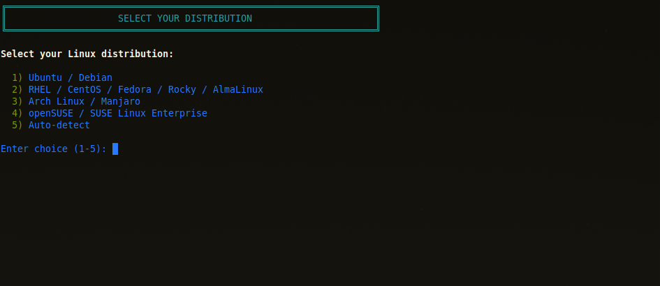
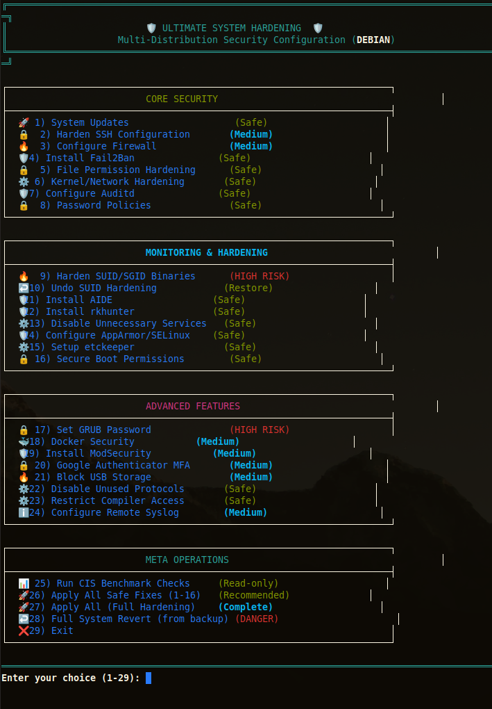
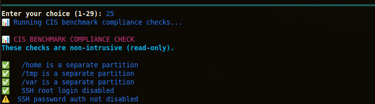

# 🛡️ Ultimate System Hardening Script


## What this script hardens

| Security Area | Actions Taken |
|---------------|----------------|
| SSH | Disables root login, enforces key-only auth, changes port (optional) |
| Firewall | Installs/configures UFW, denies all incoming except SSH/HTTP |
| Fail2ban | Auto-blocks IPs after 5 failed login attempts |
| Kernel | Disables IPv6, sets restrictive sysctl parameters |
| Filesystem | Locks /tmp, /var/tmp with noexec,nosuid |
| Auditing | Installs auditd, monitors sensitive file changes |
| Packages | Removes telnet, rsh, talk, nfs-common, netcat |

## Requirements
- **Distributions:** Ubuntu 20.04+, Debian 11+, Rocky Linux 8+, RHEL 9+
- **Root access required** (script uses `sudo`)
- **Internet connection** for package installation
- **Backup your system first** — this script makes irreversible changes

## Before vs After
**Before (default Ubuntu 22.04):**
✗ Root SSH login enabled
✗ Password auth allowed
✗ IPv6 listening on all ports
✗ /tmp mounted with exec

**After running script:**
✓ Root SSH disabled
✓ SSH key-only auth
✓ IPv6 disabled kernel-level
✓ /tmp mounted noexec,nosuid

## Key hardening features (from features.txt)
` ` `bash
$ head -20 features.txt

The script performs all 28 hardening actions:

Updates system packages

Hardens SSH (disables root, password auth, sets MaxAuthTries)

Configures nftables firewall

Installs and configures Fail2Ban

Secures file permissions

Applies kernel sysctl hardening

Configures auditd monitoring

Sets password policies

Hardens SUID binaries with backup

` ` `


## ⚠️ Disclaimer
This script disables services and removes packages. Test in a VM first.
Author not liable for production outages. By using, you acknowledge this is **irreversible** without a full system backup.

| Main Menu | Hardening Options |
|-----------|-------------------|
|  |  |

| CIS Results |
|-------------|
|  |


## Quick Start

```bash
# Clone the repository
git clone https://github.com/Kal1010101/ultimate-sys-hardening.git
cd ultimate-sys-hardening

# Interactive mode (normal)
sudo ./ultimate_hardening.sh

# Dry-run to preview changes
sudo ./ultimate_hardening.sh --dry-run

# Automatic mode (no prompts)
sudo ./ultimate_hardening.sh --auto-mode

# Skip backups (faster, risky)
sudo ./ultimate_hardening.sh --skip-backup

# Combine flags
sudo ./ultimate_hardening.sh --auto-mode --dry-run

# Show help
sudo ./ultimate_hardening.sh --help

# Full system revert (restores everything from backup)
sudo ./ultimate_hardening.sh --revert

# Revert only SUID/SGID permissions
sudo ./ultimate_hardening.sh --revert-suid

# Interactive revert is also available via menu option #28
sudo ./ultimate_hardening.sh
# Then select option 28 from the menu
