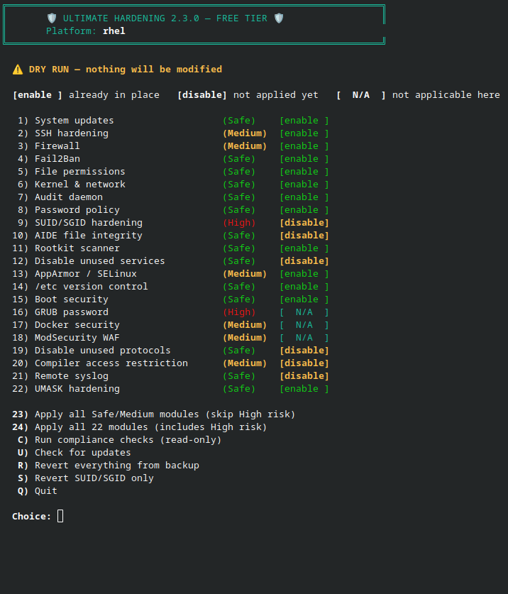
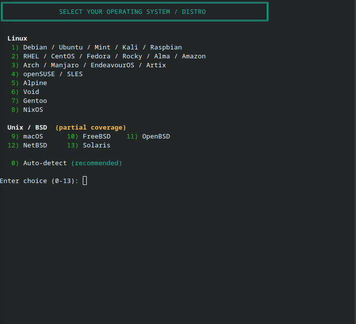
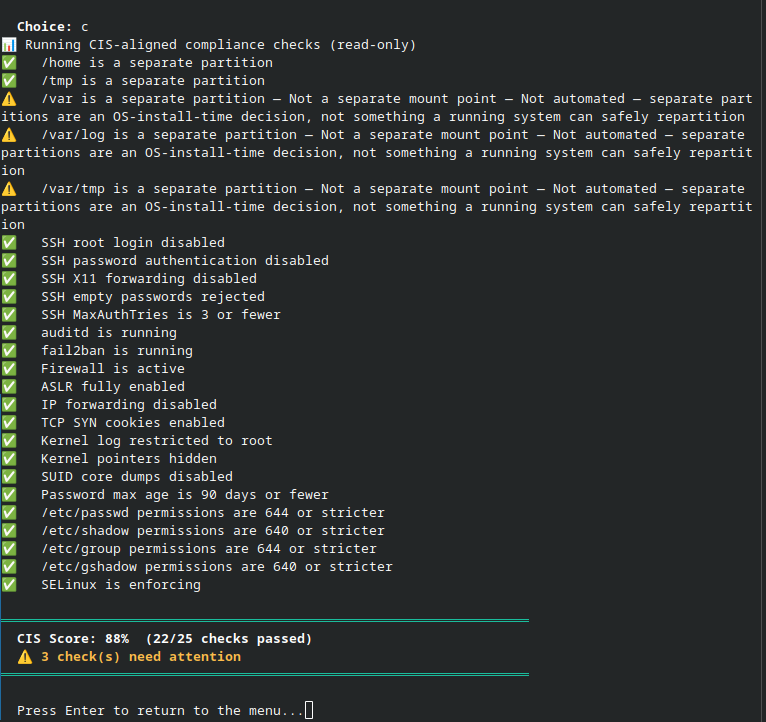

<div align="center">

# Ultimate Hardening

**CIS-aligned Linux hardening that fixes what it finds — with backup, dry-run, and full revert.**

[](https://github.com/Kal1010101/ultimate-sys-hardening/actions/workflows/shellcheck.yml)
[](LICENSE)
[](https://www.shellcheck.net/)
[](#supported-systems)

[Website](https://Kal1010101.github.io/ultimate-sys-hardening/) ·
[Security policy](SECURITY.md) ·
[Packer example](examples/packer/) ·
[Releases](https://github.com/Kal1010101/ultimate-sys-hardening/releases)

</div>

---

Most hardening tools audit and hand you a report. This one audits, applies the
fixes, and keeps a way back. Every file it touches is backed up first, and
`--revert` restores from that backup.

```bash
# See exactly what it would change — writes nothing
sudo ./ultimate_hardening.sh --auto-mode --dry-run

# Apply it
sudo ./ultimate_hardening.sh --auto-mode

# Changed your mind
sudo ./ultimate_hardening.sh --revert
```

<div align="center">
  
</div>

<p align="center"><i>Every row's status is read from the live system, not remembered between runs.</i></p>

<details>
<summary><b>More screenshots</b> — platform selection, compliance checks</summary>

<br>

**Platform selection.** Auto-detect, or choose the family yourself. BSD and
macOS are detected and adapted, with thinner coverage than Linux.

<div align="center">
  
</div>

<br>

**Compliance checks.** Read-only — it scores the system and names the module
that fixes each failure. This is the same data the menu's status tags come
from, so the two can never disagree.

<div align="center">
  
</div>

</details>

## Quick start

```bash
git clone https://github.com/Kal1010101/ultimate-sys-hardening.git
cd ultimate-sys-hardening
chmod +x src/free/ultimate_hardening.sh
sudo ./src/free/ultimate_hardening.sh
```

Running it with no flags opens an interactive menu. Nothing is applied without
confirmation.

## What it hardens

22 modules, each independently selectable from the menu. The interactive menu
shows a live `[enable ]` / `[disable]` / `[  N/A  ]` status per module, derived
from the same compliance checks `--cis-only` runs:

| # | Module | Risk | What it does |
|---|--------|------|--------------|
| 1 | System updates | Safe | Distro-aware package upgrade |
| 2 | SSH hardening | Medium | 13 settings, validated with `sshd -t` before restart |
| 3 | Firewall | Medium | nftables or UFW, default-deny inbound |
| 4 | Fail2Ban | Safe | SSH jail, ban after 3 failures |
| 5 | File permissions | Safe | `/etc/shadow`, `/etc/passwd`, sticky `/tmp` |
| 6 | Kernel / network | Safe | 25 sysctl parameters — ASLR, SYN cookies, martians |
| 7 | Auditd | Safe | Identity, sudoers, module-loading, and mount rules |
| 8 | Password policy | Safe | `login.defs` only — **PAM is never modified** |
| 9 | SUID/SGID | **High** | Strips SUID outside a safe list, inventory recorded |
| 10 | AIDE | Safe | File integrity baseline + daily cron check |
| 11 | rkhunter | Safe | Rootkit scanner with daily scan |
| 12 | Disable services | Safe | 20 unnecessary services |
| 13 | AppArmor / SELinux | Medium | Enforce mode |
| 14 | etckeeper | Safe | Git version control for `/etc` |
| 15 | Boot security | Safe | GRUB permissions, USB storage blacklist |
| 16 | GRUB password | **High** | PBKDF2 bootloader password; interactive only |
| 17 | Docker security | Medium | userns-remap, inter-container comms off, log rotation |
| 18 | ModSecurity | Medium | WAF + core rule set, only if Apache/httpd is present |
| 19 | Unused protocols | Safe | Blacklists DCCP, SCTP, RDS, TIPC |
| 20 | Compiler access | Medium | Restricts gcc/clang to root, records original modes |
| 21 | Remote syslog | Safe | Forwards to a collector on :514 |
| 22 | UMASK hardening | Safe | Default umask 027 |

## Trust

You're being asked to run a script as root that rewrites SSH and firewall config.
Here's what it does and doesn't do:

- **No telemetry.** No analytics, no phone-home, no license check. The only
  outbound traffic is your own package manager.
- **Backup before write.** Everything modified is copied to
  `/root/hardening_backup_<timestamp>/` before the first change.
- **Full revert.** `--revert` restores SSH, sysctl, and permissions.
  `--revert-suid` restores just SUID/SGID bits.
- **Dry-run.** `--dry-run` shows every intended change and exits.
- **PAM untouched.** An early version broke a login screen on an eCryptfs system.
  PAM modification was removed entirely — see [SECURITY.md](SECURITY.md).
- **SSH can't lock you out.** The config is validated with `sshd -t` and rolled
  back automatically if it fails.

## Supported systems

Auto-detected, or selectable from a menu.

**Linux** — Debian, Ubuntu, Mint, Kali, Raspbian, RHEL, CentOS, Fedora, Rocky,
AlmaLinux, Amazon Linux, Arch, Manjaro, EndeavourOS, Artix, openSUSE, SLES,
Alpine, Void, Gentoo, NixOS

**Unix / BSD** — macOS (Homebrew), FreeBSD, OpenBSD, NetBSD, Solaris
*(detected and adapted; coverage is thinner than Linux)*

Package managers: `apt`, `dnf`, `yum`, `pacman`, `zypper`, `apk`, `xbps`,
`emerge`, `brew`, `pkg`, `nix`
Init systems: systemd, OpenRC, SysV, BSD rc.d

## Usage

```
sudo ./ultimate_hardening.sh [OPTIONS]

  --auto-mode      Run without interactive prompts
  --skip-backup    Skip creating the backup directory
  --dry-run        Show what would change, apply nothing
  --cis-only       Run read-only CIS checks, print score, exit
  --revert         Restore everything from the most recent backup
  --revert-suid    Restore only SUID/SGID permissions
  --help           Show this help
```

## CI and image builds

`--cis-only` exits after printing a machine-readable score, which makes it usable
as a build gate:

```bash
score=$(sudo ./ultimate_hardening.sh --cis-only | grep -oP 'CIS Score: \K[0-9]+')
[ "$score" -lt 80 ] && exit 1
```

See [`examples/packer/`](examples/packer/) for a complete golden-image pipeline
that hardens an AMI and fails the build if the score regresses.

## Tiers

The free tier is MIT licensed, with no expiry and nothing held back for a
paywall — it's also an early-stage project, and the module set will keep
growing. Paid tiers add reporting and fleet management on top of the same
engine.

| | Free | Pro | Enterprise |
|---|---|---|---|
| **Price** | $0 | $9/mo · $79/yr | $49/mo (≤10 hosts) |
| Hardening modules | ✅ | ✅ | ✅ |
| CIS checks | ✅ | ✅ | ✅ |
| Dry-run + revert | ✅ | ✅ | ✅ |
| HTML compliance reports | — | ✅ | ✅ |
| Open ports / failed logins | — | ✅ | ✅ |
| Scheduled runs + email | — | ✅ | ✅ |
| Multi-host dashboard | — | — | ✅ |
| Remote SSH deploy | — | — | ✅ |
| Policy-as-code + drift | — | — | ✅ |
| JSON / CSV export | — | — | ✅ |
| OpenSCAP integration | — | — | ✅ |

[Full comparison →](https://Kal1010101.github.io/ultimate-sys-hardening/#pricing)

## Standards coverage

Honest scope — including the gaps.

| Standard | Status |
|----------|--------|
| CIS Benchmarks | CIS-**aligned** checks. Not a certified CIS-CAT implementation. |
| Automated remediation | Available |
| Continuous compliance / drift | Available (Enterprise) |
| OpenSCAP | Available (Enterprise) — wraps `oscap`, folds results into reports |
| Packer / Terraform | Available — [example included](examples/packer/) |
| Fleet scale | Small fleets (tens of hosts). Remote deploy is a sequential SSH loop. |
| DISA STIG | Roadmap |
| NIST SP 800-70 | Roadmap |
| Ansible role | Roadmap |

## Roadmap

- [ ] DISA STIG profile mapping
- [ ] NIST SP 800-70 checklist mapping
- [ ] Ansible role packaging
- [ ] Parallel remote deploy (beyond sequential SSH)
- [ ] Service-impact simulation before apply

## Contributing

Issues and PRs welcome. Every push runs ShellCheck and `bash -n` against Debian,
Ubuntu, Fedora, and Alpine — please make sure both pass locally first:

```bash
shellcheck -e SC2034 -e SC1091 src/**/*.sh
bash -n src/**/*.sh
```

Security issues go through [SECURITY.md](SECURITY.md), not the public tracker.

## License

MIT — see [LICENSE](LICENSE). Commercial use of the free tier is unrestricted.
